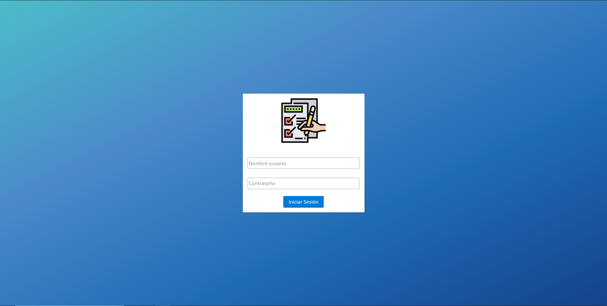
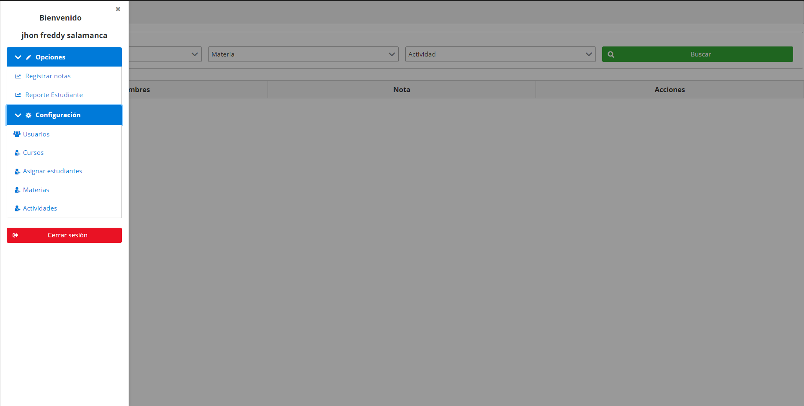
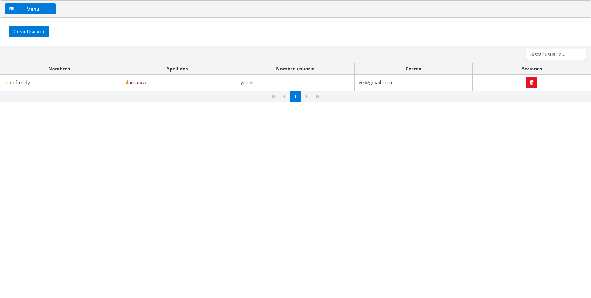
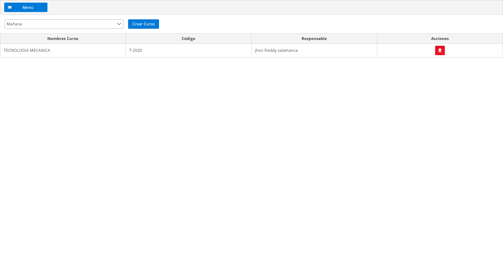
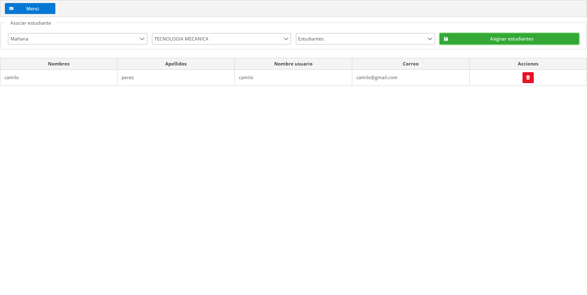
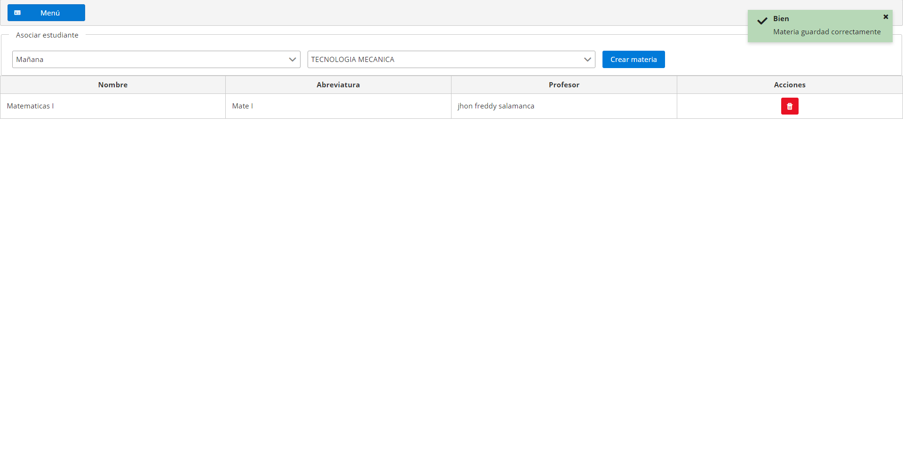
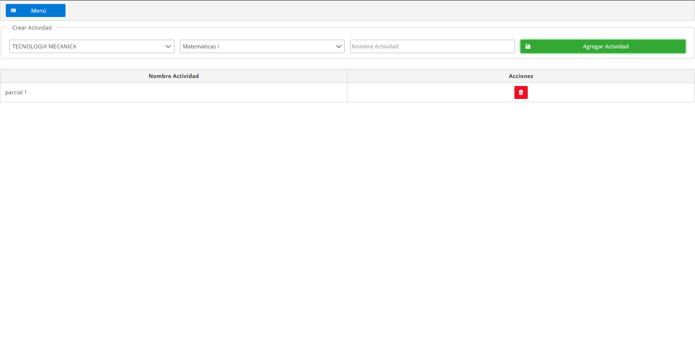
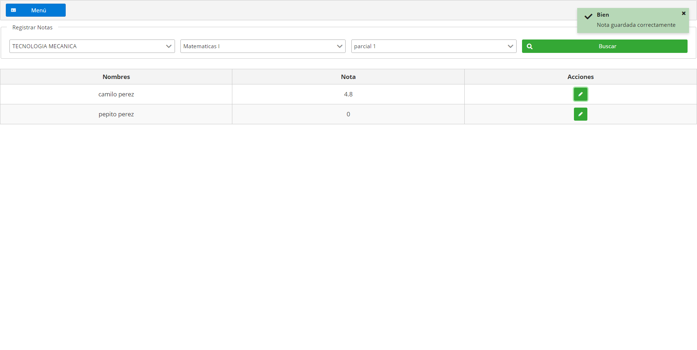
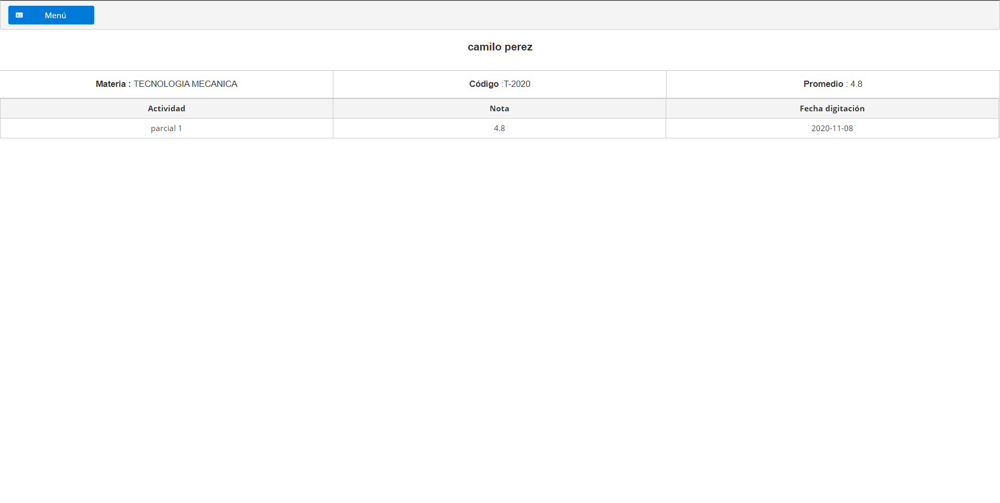

# Notas

Aplicación para el registro de notas para estudiantes de colegio o entidades de educación superior.

## Funcionalidades 

* Autenticacion con oauth2 y jwt (Json Web Token)

### Rol administrador

* Gestion de usuario (profesores y estudiantes)
* Gestion de cursos o programas academicos.
* Asignación de estudiantes a un curso.
* Registro de materias de un curso.
* Registro de actividades de una materia.
* Regitro de notas.

### Rol estudiante 

* vista de visualización de notas registradas por los profesores.

## Construido con 🛠️

Este proyecto esta construido con las siguientes tecnologias:

## Backend 

* Java 1.8
* Spring MVC with Spring Boot
* Postgres
* Maven
* Flyway
* Oauth2
* Sptring Security
* Jwt (Json Web Token)

## Frontend

* Angular 9
* PrimeNg

 * La arquitectura web está construida con los siguientes componentes:
   * DTO: Objetos que se usan para la comunicación a través de las API
   * Controller: Responde a eventos lanzados por el usuario desde la web.
   * Service: Implementa la logica de procesamiento de información y la logica de negocio.
   * Repository: Interfaces para la base de datos, guarda, elimina y consulta.
   * Entity: Entidades de la base de datos.
   

## Capturas de pantalla

* Login	

* Menu.

* Gestión de usuario del sistema.

* Gestión de cursos o programas academicos.

* Asignación de estudiantes a un curso.

* Gestión de materias.

* Gestión de actividades.

* Registro de notas.

* Visualización de notas por parte del estudiante.

## Autores ✒️

* **Jhon Freddy salamanca** - [jhonfre1994](https://github.com/jhonfre1994)

